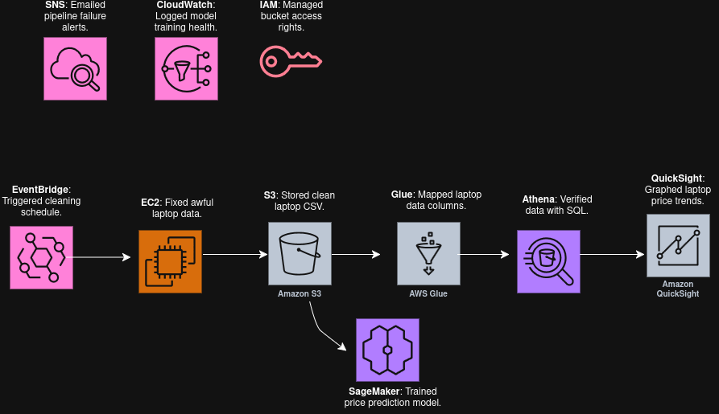
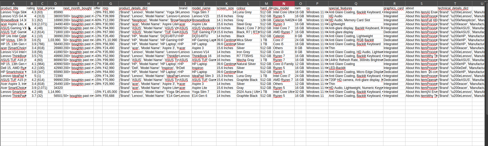
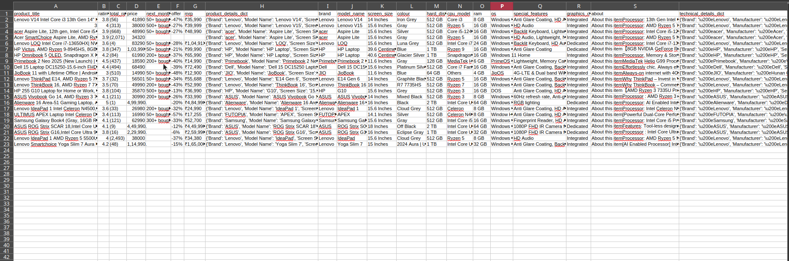
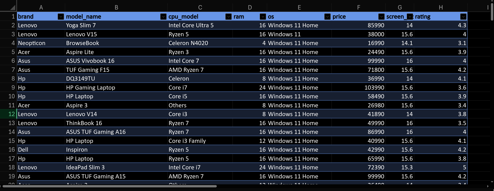
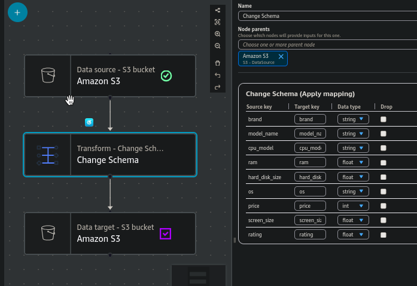
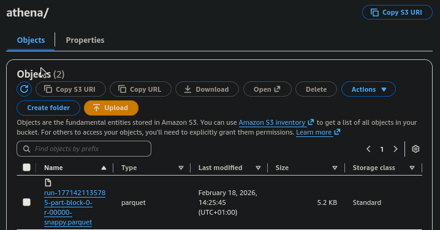
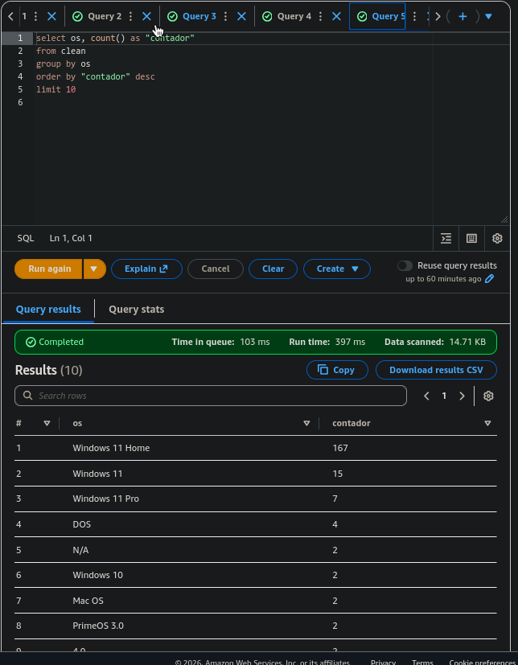
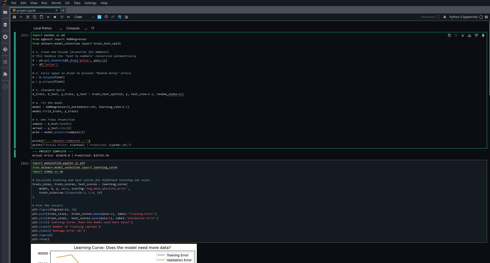

# 💻 AWS Laptop Price Prediction: End-to-End Data Pipeline

This project demonstrates a **production-grade AWS architecture** designed to transform a fragmented, "awful" dataset into a reliable machine learning model. It covers the entire lifecycle: **Automation**, **Data Engineering**, **Machine Learning**, and **Governance**.

---

---

## 📊 Data Source
The raw data for this project was sourced from **Kaggle**:

* **Dataset Link:** [Amazon Laptop Messy Dataset](https://www.kaggle.com/datasets/rudraprasadbhuyan/amazon-laptop-messy-dataset)
* **Original Format:** 10 separate CSV files requiring significant cleaning and consolidation.

---

## 🏗️ Architecture Overview
* **EventBridge**: Automates pipeline triggers.
* **EC2**: Preprocesses 10 messy CSVs using Python.
* **S3**: Centralized data lake storage with **Parquet** optimization.
* **Glue**: Mapped the data schema and managed the Data Catalog.
* **Athena**: Validated data structure with SQL.
* **QuickSight**: Visualized laptop price trends.
* **SageMaker**: Trained XGBoost prediction model.
* **IAM**: Managed secure service access.
* **CloudWatch**: Logged model training health.
* **SNS**: Alerted via email on pipeline failures.

---

## 🧹 The "Awful Data" Challenge
The project began with 10 separate, inconsistent CSV files. The data was unusable due to missing values, mixed units (GB vs TB), and corrupted strings.

### 🛠️ The Rescue (EC2 + Python)
I deployed a dedicated **Amazon EC2** instance to run a Python-based consolidation script that:
1.  **Merged** 10 fragmented datasets into one master file.
2.  **Standardized** hardware specs using Regex (Regular Expressions).
3.  **Cleaned** the "Excel mess" to ensure high-quality input for the model.

#### Raw Data Samples

#### Cleaned Output

---

## ⚡ Performance Optimization: AWS Glue ETL
To ensure the pipeline was cost-effective and the data was "ML-ready," I used **AWS Glue** to perform a specialized ETL (Extract, Transform, Load) job.

### 🛠️ Data Transformation & Schema Mapping
Instead of just moving the files, I configured a Glue Job to:
* **Convert Format**: Transformed the raw CSV data into **Apache Parquet**, a columnar storage format.
* **Schema Casting**: Manually mapped and changed **Data Types** (e.g., converting "Price" from a generic string to a numeric decimal) to ensure mathematical accuracy in SageMaker and Athena.

### 💰 Why it Matters:
* **Storage Efficiency**: Parquet reduced the storage footprint in S3 significantly compared to the original 10 CSVs.
* **Cost & Speed**: By utilizing Parquet's columnar structure, **Amazon Athena** queries now scan 90% less data, making the analytics layer faster and cheaper.

---

## 📊 Advanced Data Visualization: TIBCO TDV
To gain deeper insights from the optimized `.parquet` files, I utilized **TIBCO TDV (Data Virtualization)**. 

By connecting TDV directly to the S3 data lake, I was able to:
* **Federated Queries**: Query the Parquet files without the need for additional data movement.
* **Business Intelligence**: Create a virtualized view of the laptop price data to generate complex visualizations and trend reports.

---

## 🚀 Data Workflow
The pipeline follows two distinct paths once the cleaned data reaches Amazon S3:

### 1. The Analytics Path (Validation & BI)
**AWS Glue** catalogs the data, allowing **Amazon Athena** to run validation queries.

### 2. The ML Path (Intelligence)
**Amazon SageMaker** pulls the optimized Parquet data to train an **XGBoost Regression** model.

---

## 🛡️ Cloud Governance & Cleanup
To follow AWS best practices for cost management and security, I utilized my custom tool:

* **Tool Used**: [AWS-Governance-Cleanup-Tool](https://github.com/ManuCem/AWS-Governance-Cleanup-Tool)
* **Action**: Automatically decommissioned unused resources (EC2, S3, SageMaker) to prevent **"Cloud Sprawl"** and unnecessary billing.

---

## 🌟 Key Skills Demonstrated
* **Cloud Architecture**: Designing automated "Hub and Spoke" pipelines.
* **Data Engineering**: Handling 10+ fragmented sources and **Parquet optimization**.
* **Machine Learning**: Feature engineering and XGBoost implementation.
* **Governance**: Resource lifecycle management and cost control.
