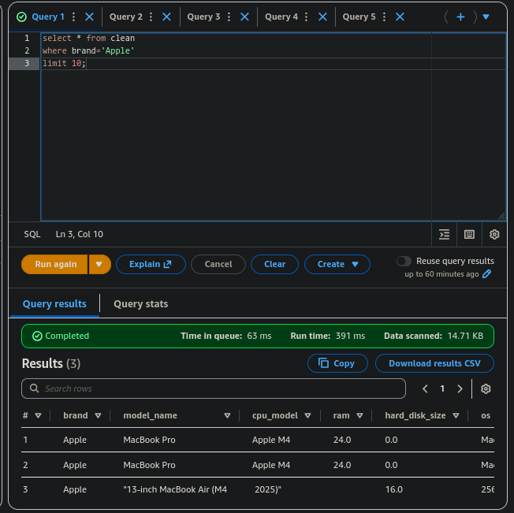
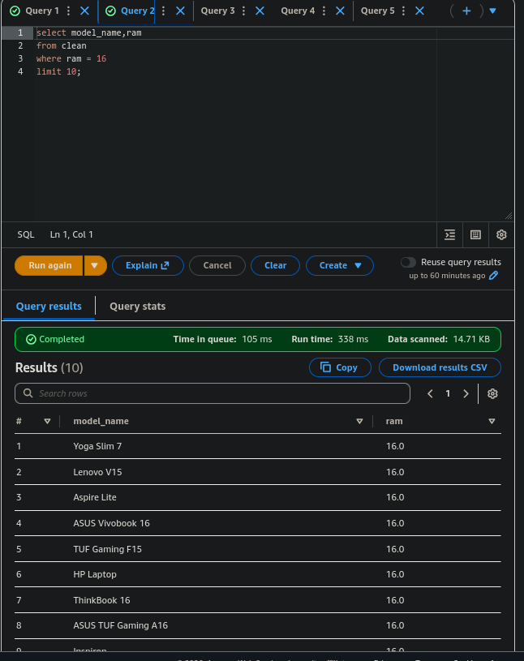
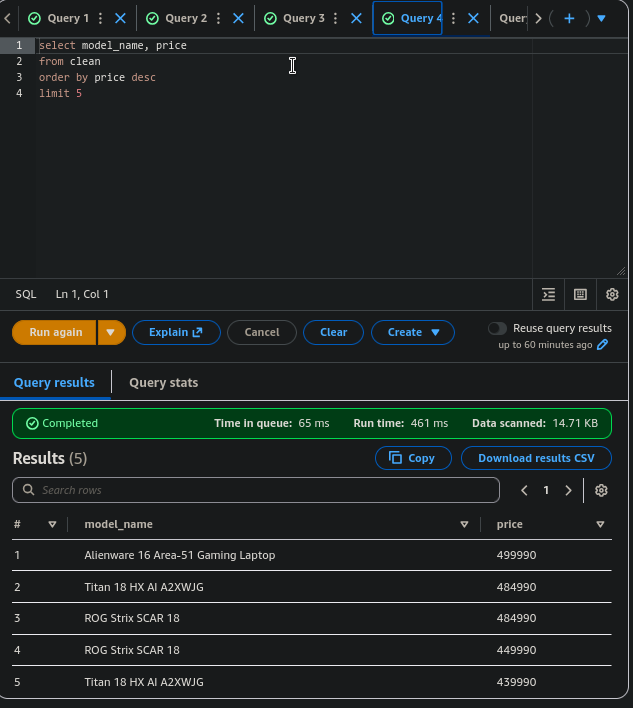
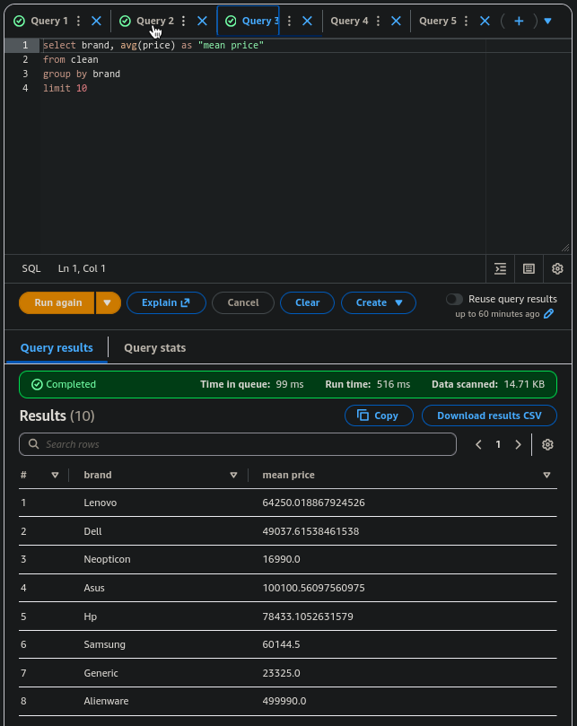

AWS Laptop Price Prediction: End-to-End Data Pipeline
This project demonstrates a production-grade AWS architecture designed to transform a fragmented, "awful" dataset into a reliable machine learning model. It covers the entire lifecycle: Automation, Data Engineering, Machine Learning, and Governance.

📊 Data Source
The raw data for this project was sourced from Kaggle:

Dataset Link: https://www.kaggle.com/datasets/rudraprasadbhuyan/amazon-laptop-messy-dataset

Original Format: The source provided the data in 10 separate CSV files requiring significant cleaning and consolidation.

🏗️ Architecture Overview
EventBridge: Automates pipeline triggers.

EC2: Preprocesses 10 messy CSVs using Python.

S3: Centralized data lake storage with Parquet optimization.

Glue: Mapped the data schema and managed the Data Catalog.

Athena: Validated data structure with SQL.

QuickSight: Visualized laptop price trends.

SageMaker: Trained XGBoost prediction model.

IAM: Managed secure service access.

CloudWatch: Logged model training health.

SNS: Alerted via email on pipeline failures.

🧹 The "Awful Data" Challenge
The project began with 10 separate, inconsistent CSV files. The data was unusable due to missing values, mixed units (GB vs TB), and corrupted strings.

The Rescue (EC2 + Python)
I deployed a dedicated Amazon EC2 instance to run a Python-based consolidation script that:

Merged 10 fragmented datasets into one master file.

Standardized hardware specs using Regex (Regular Expressions).

Cleaned the "Excel mess" to ensure high-quality input for the model.

⚡ Performance Optimization: CSV to Parquet
To ensure the pipeline was cost-effective and scalable, I implemented a format conversion:

Storage Efficiency: Transformed the final consolidated dataset from CSV to Apache Parquet, significantly reducing file size.

Query Performance: Enabled Amazon Athena to perform columnar scans, reducing query costs by up to 90% and increasing speed.

🚀 Data Workflow
The pipeline follows two distinct paths once the cleaned data reaches Amazon S3:

1. The Analytics Path (Validation & BI)
AWS Glue catalogs the data, allowing Amazon Athena to run validation queries.

Insights are then visualized in Amazon QuickSight dashboards to track price trends.

2. The ML Path (Intelligence)
Amazon SageMaker pulls the optimized Parquet data to train an XGBoost Regression model.

🛡️ Cloud Governance & Cleanup
To follow AWS best practices for cost management and security, I utilized my custom tool:

Tool Used: AWS-Governance-Cleanup-Tool

Action: Upon project completion, the tool was used to automatically identify and decommission unused resources (EC2 instances, S3 buckets, and SageMaker endpoints) to prevent "Cloud Sprawl" and unnecessary billing.

🌟 Key Skills Demonstrated
Cloud Architecture: Designing automated "Hub and Spoke" pipelines.

Data Engineering: Handling 10+ fragmented sources and Parquet columnar optimization.

Machine Learning: Feature engineering and XGBoost implementation.

Governance: Using custom automation to manage resource lifecycles and costs.
